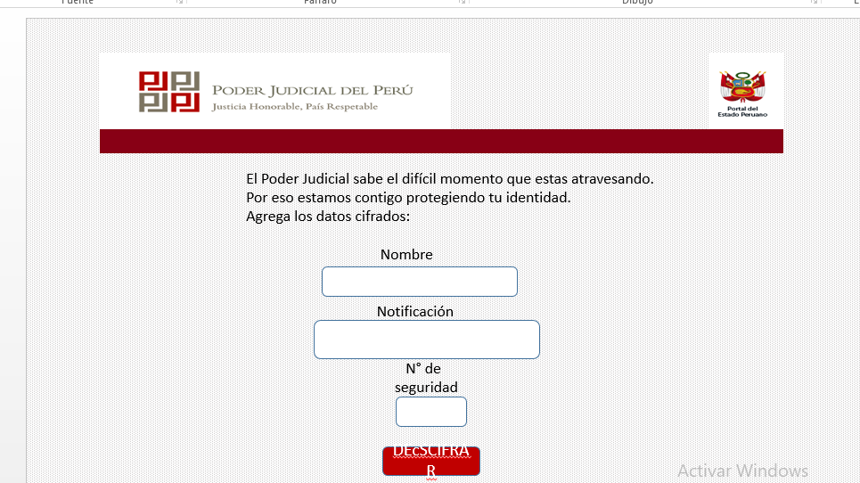

**`README.md`**:

Cifrado para el Poder Judicial 
Mi proyecto va dirigido a proteger la identidad y el derecho a reservar el contenido de la Notificación enviada a las víctimas de abuso de parte del Poder Judicial. 
Investigación UX:
1.	Mis usuarios son los trabajadores del Poder Judicial y las víctimas de abuso. El primero cifraría los datos y notificación; la segunda descifraría su información de manera personal.
2.	Las víctimas de abuso no ya se verían expuestas a que cualquier persona que reciba y lea su notificación.
El PJ estaría acortando su proceso y ahorrando en servicio de mensajería.

  3. Luego colocarás la foto de tu primer prototipo en papel.
 
 
 
 
 
 
  
  4. Agregar un resumen del feedback recibido indicando las mejoras a realizar.
  Mis compañeras me indicaron que de debería tener una vista para el cifrado y botones de regreso.
  ## Objetivos de aprendizaje Cipher

A continuación te presentamos los objetivos de aprendizaje de este proyecto. Reflexiona y luego marca los objetivos que has llegado a **entender** y **aplicar** en tu proyecto.

### UX

- [x] Diseñar la aplicación pensando y entendiendo al usuario.
- [x] Crear prototipos para obtener feedback e iterar.
- [ ] Aplicar los principios de diseño visual (contraste, alineación, jerarquía).

### HTML y CSS

- [ ] Uso correcto de HTML semántico.
- [x] Uso de selectores de CSS.
- [ ] Construir tu aplicación respetando el diseño realizado (maquetación).

### DOM

- [ ] Uso de selectores del DOM.
- [ ] Manejo de eventos del DOM.
- [ ] Manipulación dinámica del DOM.

### Javascript

- [ ] Manipulación de strings.
- [ ] Uso de condicionales (if-else | switch).
- [ ] Uso de bucles (for | do-while).	
- [ ] Uso de funciones (parámetros | argumentos | valor de retorno).
- [x] Declaración correcta de variables (const & let).

### Testing
- [ ] Testeo de tus funciones.

### Git y GitHub
- [ ] Comandos de git (add | commit | pull | status | push).
- [ ] Manejo de repositorios de GitHub (clone | fork | gh-pages).

### Buenas prácticas de desarrollo
- [x] Uso de identificadores descriptivos (Nomenclatura | Semántica).
- [ ] Uso de linter para seguir buenas prácticas (ESLINT).

 
